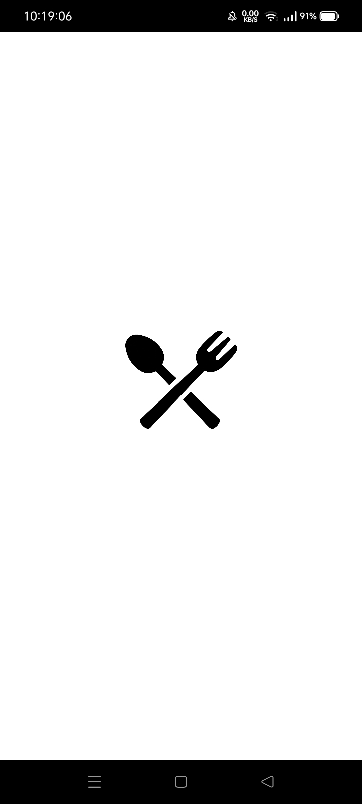
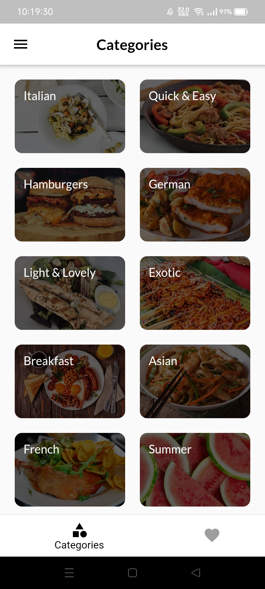
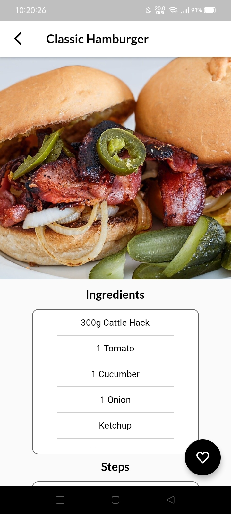
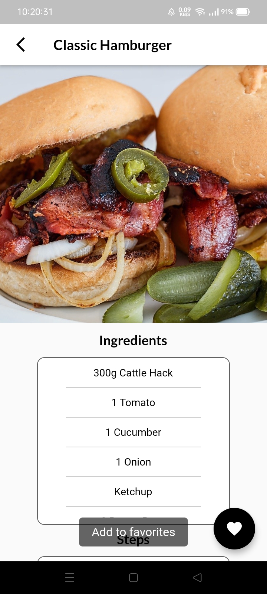
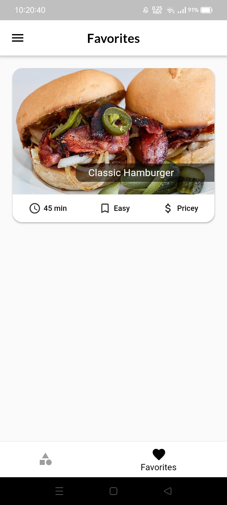
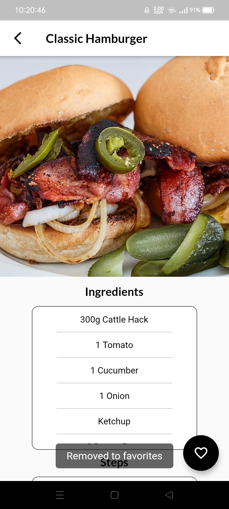
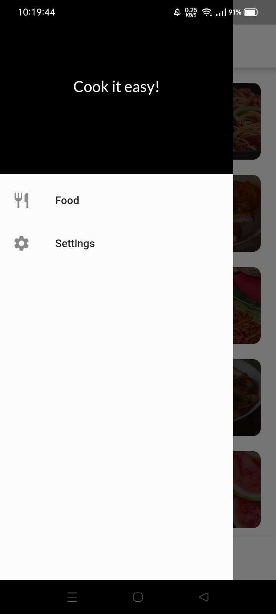
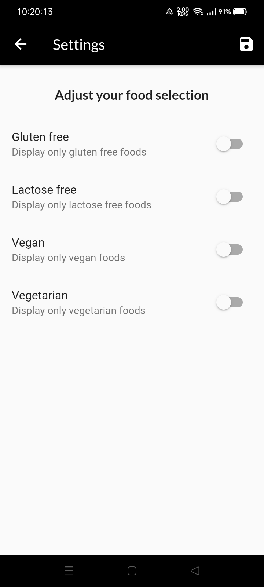

# food_app

This was my third project in Flutter, where it focuses on navigation and pushing and pulling data from a class model.

## Features of the App

- Browse foods by category and mark them as favorites if you like them.
- Set filters where you can decide which kind of food you want to include, like vegetarian, vegan, and lactose
- Show all of the food lists based on their categories.

## Added soon

- Firebase Authentication by using your email or phone
- Creating CRUD functions by using Firebase Firestore
- Introduction screens

## Screenshots

